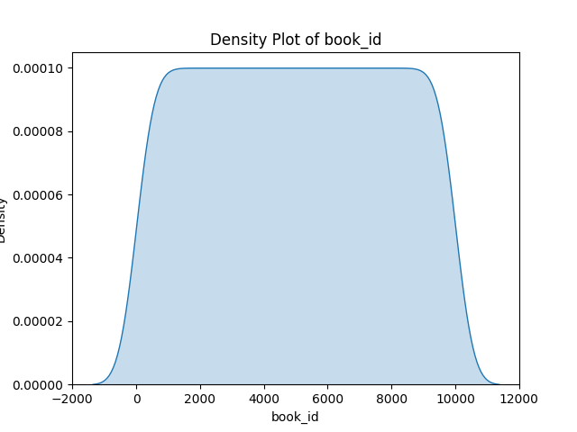
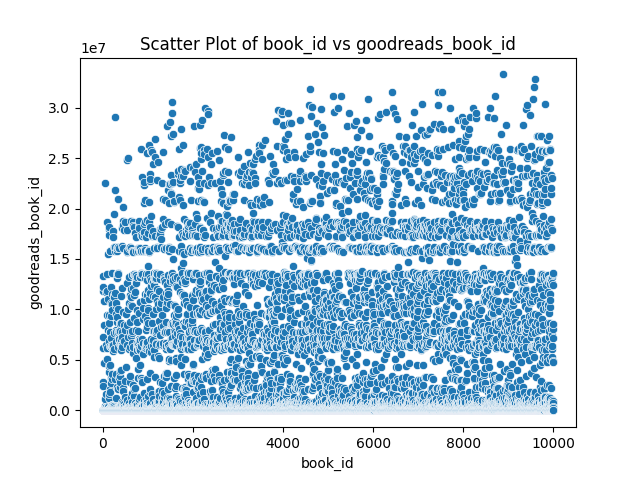
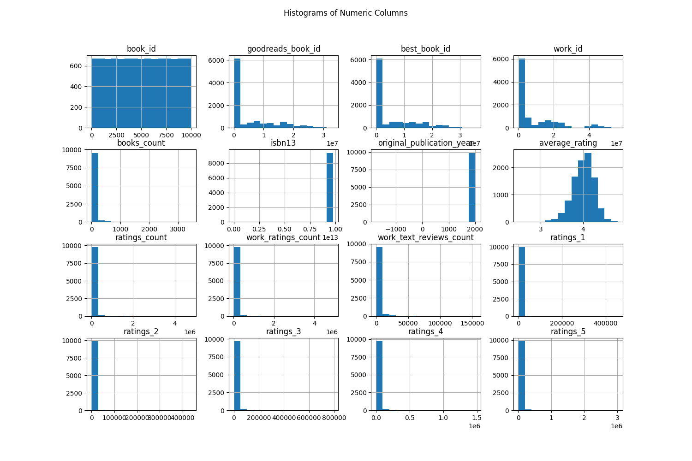

# Automated Analysis Report
Based on the dataset summary and insights below, here's a comprehensive analysis:

### Overview of the Dataset

- The dataset contains **10,000 books** with columns such as `book_id`, `goodreads_book_id`, `best_book_id`, `work_id`, and others related to book ratings and authorship.
- The average ratings and counts indicate that the dataset includes diverse books with varying levels of popularity and critiques.

### Insights from the Summary

1. **Missing Values**:
   - **Response**: There are a few columns with missing values, most notably in `isbn`, `isbn13`, `original_publication_year`, and `original_title`. This could affect any analysis that requires these fields, especially since they have a significant number of missing entries.
   - **Recommendation**: Address these missing values either by imputation or exclusion for analyses that depend on these fields.

2. **Ratings Analysis**:
   - **Distribution of Ratings**: The ratings columns (`ratings_1`, `ratings_2`, `ratings_3`, `ratings_4`, `ratings_5`) show positive correlations with each other, suggesting that books which receive high counts for one rating often receive high counts in others. Notably, there’s a very high correlation between `ratings_4` and `ratings_5`, suggesting that books rated favorably tend to receive a significant number of 4 and 5-star ratings.
   - **Predictions on Quality**: If a book has a high total ratings count, it is more likely to have a higher average rating.

3. **Books Count**:
   - The `books_count` variable has a slight negative correlation with `ratings_count` and `work_ratings_count`. This could imply that books associated with a larger collection or volumes do not necessarily translate to higher individual ratings, indicating that quality may not scale with quantity.

### 1. Density Plot

- **Description**: If constructed, the density plot for the first numeric column (most likely `average_rating`, based on common datasets) would likely show a distribution centered around a certain value, potentially skewed towards higher ratings due to the nature of reader reviews. Generally, ratings often cluster around the middle of the scale (3-5 stars) with fewer low ratings.

### 2. Scatter Plot

- **Relationship**: A scatter plot between the first two numeric columns (for example, `ratings_count` vs `average_rating`) may reveal a positive relationship
## Density Plot
This plot shows the distribution of the first numeric column.

## Scatter Plot
This plot shows the relationship between the first two numeric columns.

## Histogram
This plot shows the distribution of all numeric columns.

