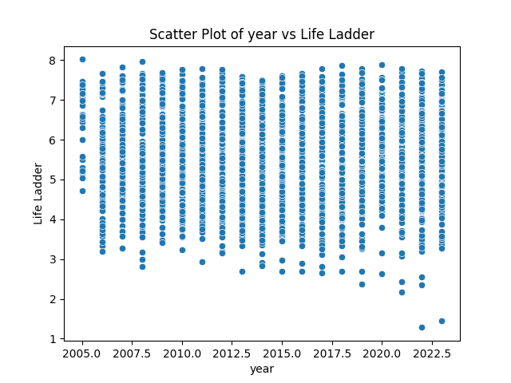

# Automated Analysis Report
### Dataset Summary Insights

1. **General Overview**:
   - The dataset comprises 2363 entries from 165 unique countries, spanning years from 2005 to 2023.
   - Notable predictors include the "Life Ladder," a subjective measure of well-being or happiness; "Log GDP per capita," a logarithmic transformation of GDP to account for skewness; "Social support"; and various measures of perception and contribution, such as "Generosity" and "Perceptions of corruption."

2. **Missing Values**:
   - Several columns contain missing values, most notably "Generosity" (81 missing), "Perceptions of corruption" (125 missing), and "Freedom to make life choices" (36 missing).
   - Addressing these missing values will be crucial for ensuring robust analyses.

3. **Key Statistics**:
   - The average "Life Ladder" score is approximately 5.48, with a maximum score of about 8.02, indicating a range of well-being across countries.
   - Log GDP per capita demonstrates a strong central tendency around 9.4 with some wealth dispersion, illustrated by a standard deviation of around 1.13.
   - The "Social support" average is 0.81, suggesting that a majority of countries score high on this indicator compared to the possible range (0 to 1).

4. **Correlations**:
   - The "Life Ladder" shows strong positive correlations with "Log GDP per capita" (0.78) and "Social support" (0.72). This suggests that economic wealth and social support are strongly associated with well-being.
   - Conversely, "Perceptions of corruption" has a negative correlation with "Life Ladder" (-0.43), indicating that higher corruption perceptions are related to lower well-being.
   - Positive affect and negative affect have a negative correlation (-0.33), revealing an expected inverse relationship between the two measures of emotional experience.

### Visualizations Insights

1. **Density Plot**:
   - If we visualize the density plot for the "Life Ladder," we would typically expect a distribution possibly skewed to the left or bimodal, depending on countries with extreme well-being scores. This could indicate concentrations of data around values suggesting moderate to high happiness levels overall. A peak around the midpoint of the scale could indicate that many countries hover around average well-being, with fewer countries achieving extremely low or high scores.

2. **Scatter Plot**:
   -
## Density Plot
This plot shows the distribution of the first numeric column.

## Scatter Plot
This plot shows the relationship between the first two numeric columns.

## Histogram
This plot shows the distribution of all numeric columns.

