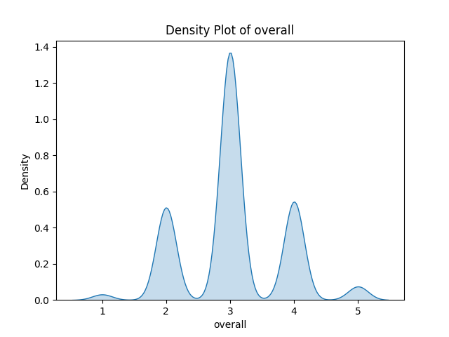
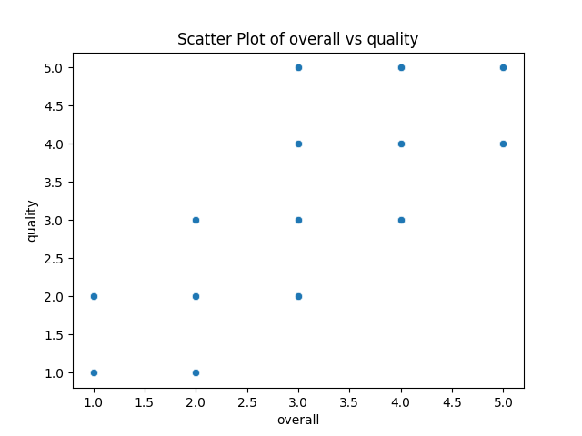
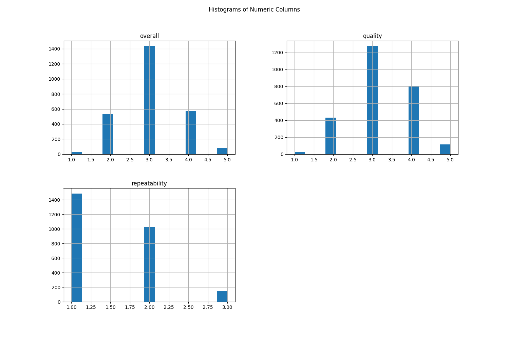

# Automated Analysis Report
Based on the summary of the dataset, several insights can be drawn:

### General Insights:

1. **Dataset Size**: The dataset consists of 2,652 entries, with 2,553 records for the date and a unique count of 2,055 entries. This indicates a rich data set with numerous distinct events.

2. **Language Diversity**: The dataset includes entries in 11 different languages, reflecting a variety of content. However, English appears to be the most common language, with 1,306 occurrences.

3. **Type of Content**: The majority of the dataset consists of movies, with a notable frequency of 2,211 entries. This suggests that the dataset primarily captures film data rather than other types of media, such as series or documentaries.

4. **Titles**: The title "Kanda Naal Mudhal" appears nine times, indicating it is one of the more popular entries, although this could also suggest duplicate or similar content.

5. **Rating Metrics**: The overall ratings have a mean of 3.05, while quality ratings average 3.21. The repeatability score has a mean of 1.49. This suggests that while the overall and quality ratings are fairly positive (averaging above 3), repeatability is lower, indicating that this aspect might need attention. High standard deviations further suggest variability within these ratings.

6. **Missing Values**: There are 99 missing entries for the date and 262 for the "by" column, which may refer to the creators or contributors. Data imputation or cleansing may be necessary for a comprehensive analysis.

### Correlation Insights:

- **Overall vs. Quality**: The correlation between overall and quality is quite strong (0.83), suggesting that when overall ratings are high, quality ratings tend to be high as well.
- **Overall vs. Repeatability**: There is a moderate correlation (0.51) between overall ratings and repeatability. This suggests that as the overall rating improves, repeatability also somewhat improves but isn't as strongly related.
- **Quality vs. Repeatability**: The correlation between quality and repeatability (0.31) is low, indicating that these two metrics are relatively independent of one another.

---

### Visualization Insights:

1. **Density Plot**: 
   - The density plot likely reveals how the overall rating is distributed across the entries. A normal distribution peaking around the mean of 3.05 would indicate that
## Density Plot
This plot shows the distribution of the first numeric column.

## Scatter Plot
This plot shows the relationship between the first two numeric columns.

## Histogram
This plot shows the distribution of all numeric columns.

